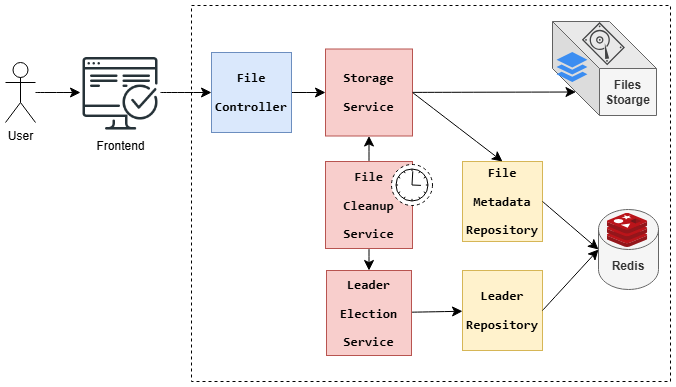

# Simple Storage Manager Service

A Spring Boot REST API for managing file storage with retention periods, using Redis for metadata storage and leader election to delete expired files.

---

## Table of contents
* [Requirements](#requirements)
* [Solutions](#solutions)
* [Architecture](#architecture)
* [Technologies](#technologies)
* [Features](#features)
* [Prerequisites](#prerequisites)
* [Getting Started](#getting-started)
* [API Endpoints](#api-endpoints)
* [Future Enhancements](#future-enhancements)
* [References](#references)
* [About me](#about-me)
* [Contributing](#contributing)
* [Acknowledgments](#acknowledgments)

---

## Requirements
**Simple Storage Manager service**
Develop rest service with the following:
- **SaveFile endpoint** with payload of file and it's retention period
- **Delete the expired files** regarding it's saved retention period (automated not from request)
- **Use leader election pattern** to execute delete.
- **saving on local**
- Add and use **Service config** for saving path
- Add and use **Service config** for delete cycle time (run every 10 minutes for example)

---

## Solutions
Implementing leader election can be done using different approaches:
- **ZooKeeper**: 
    Use ZooKeeper as the coordination service provides high reliability.
- **Spring Cloud Kubernetes**
    If the application is deployed in Kubernetes, we can use its native leader election capabilities via Spring Cloud Kubernetes.
- Custom Leader Election with **Redis**
  Redis is a lightweight and simple leader election in smaller-scale systems. It has SETNX (set if not exists) command we can use it for leader election.

### Selected Solution
For simplicity, we will implement leader election using **Redis**

---

## Architecture
The  next diagram shows the system architecture



---

## Features
- **Save File**: Uploads a file with a retention period.
- **Leader Election**: Ensures only one instance handles file deletion in distributed setups.
- **Delete Expired Files**: Automatically removes files after their expiration time using leader election.
- **Redis Integration**: Stores file metadata in Redis for efficient access.
- **Dockerized**: Includes Docker support for seamless deployment.
- **Swagger OpenAPI**: Provides API documentation.

---

## Technologies
This project is created using the following technologies:

1. Java 21
2. Maven Dependency Management
3. Spring Boot:
    - Spring Web
    - Spring Data Redis
    - Swagger OpenAPI
4. Docker
5. Lombok

---

## Prerequisites
- [Java 21](https://jdk.java.net/21/) installed if running locally without Docker.
- [Maven](https://maven.apache.org/install.html) for local running.
- [Docker](https://www.docker.com/get-started) installed on your machine.

---

## Getting Started

### **Clone the Repository**
```bash
git clone https://github.com/SayedBaladoh/Simple-Storage-Manager-Service.git
cd Simple-Storage-Manager-service
```

### **Build and Run with Docker Compose**

#### Build and Start Containers
```bash
docker-compose up --build
```

You can verify whether the project was started with Redis
```bash
docker ps
```

### **Running Locally (Without Docker)**

#### 1. **Start Redis Locally**
   ```bash
   redis-server
   ```

#### 2. **Update Application Configuration**
The application is configured via `application.yml`:
```yaml
spring:
  data:
      redis:
        host: ${SPRING_REDIS_HOST:localhost}
        port: ${SPRING_REDIS_PORT:6379}
storage:
  path: ${STORAGE_PATH:./uploads}
  delete-cycle-time-in-minutes: ${DELETE_CYCLE_TIME_IN_MINUTES:10}
```

##### Environment Variables
- `SPRING_REDIS_HOST`: Redis hostname (default: `localhost`).
- `SPRING_REDIS_PORT`: Redis port (default: `6379`).
- `STORAGE_PATH`: storage path (default: `./uploads`).
- `DELETE_CYCLE_TIME_IN_MINUTES`: Delete cycle time in minutes (default: `10`).


#### 3. **Build and Run**
   ```bash
   mvn clean install
   mvn spring-boot:run
   ```
   
Or
   ```bash
   mvn clean package
   java -jar target/storage-manager-service-1.0.0.jar
   ```


### **Access the Application**
- **API Base URL**: `http://localhost:8081`
- **Health Check**: `http://localhost:8081/actuator/health`
- **Swagger UI**: `http://localhost:8081/docs` or `http://localhost:8081/swagger-ui/index.html`

---

## API Endpoints

### **Upload / Save File**
- **Endpoint**: `POST /api/files`
- **Payload**:
    - `file`: The file to upload (multipart).
    - `retentionPeriodInMinutes`: Retention period in minutes (integer).
- **Example Request**:
  ```bash
  curl -X 'POST' \
  'http://localhost:8081/api/files' \
  -H 'Content-Type: multipart/form-data' \
  -F 'file=@S2590005621000503.bib' \
  -F 'retentionPeriodInMinutes=10'
  ```

---

## Future Enhancements
- Implement authentication and authorization.
- Add unit and integration test.
- Add support for cloud storage (like: AWS S3).

---

## References
- [Leader Election Using Spring-Boot](https://allanvital.com/leader-election-using-spring-boot/)
- [Distributed Locking with Redis](https://carlosbecker.com/posts/distributed-locks-redis/)
- [Using Leader Election with Spring Cloud Kubernetes and Spring Scheduler](https://medium.com/@pedrommj8/using-leader-election-with-spring-cloud-kubernetes-and-spring-scheduler-8f7ea3e3e694)
- [Distributed locks and synchronizers](https://redisson.org/docs/data-and-services/locks-and-synchronizers/)
- [Spring Leader Election](https://docs.spring.io/spring-cloud-kubernetes/docs/current/reference/html/leader-election.html)
- [Zookeeper Tutorial — With Practical Example](https://bikas-katwal.medium.com/zookeeper-introduction-designing-a-distributed-system-using-zookeeper-and-java-7f1b108e236e)
- [Navigating the Jungle of Distributed Systems: A Guide to ZooKeeper and Leader Election Algorithms](https://hewi.blog/navigating-the-jungle-of-distributed-systems-a-guide-to-zookeeper-and-leader-election-algorithms)
- [Leader election in a Distributed System Using ZooKeeper](https://www.geeksforgeeks.org/leader-election-in-a-distributed-system-using-zookeeper/)
- [A practical example of the leader election in distributed systems](https://tolonbekov.medium.com/a-practical-example-of-the-leader-election-process-in-distributed-systems-2e1ce9aa42a6)
- [Leader election in a distributed system using ZooKeeper](https://medium.com/@minhaz1217/leader-election-in-a-distributed-system-using-zookeeper-b562e6d79855)

---

## About me

I am Sayed Baladoh - Phd. Tech Lead / Principal Software Engineer. I like software development. You can contact me via:

* [LinkedIn](https://www.linkedin.com/in/sayedbaladoh/)
* [Mail](mailto:sayedbaladoh@yahoo.com)
* [Phone +20 1004337924](tel:+201004337924)

**Any improvement or comment about the project is always welcome! As well as others shared their code publicly I want to share mine! Thanks!**_

## Contributing
Any improvement or comment about the project is always welcome! Please create a pull request or submit an issue for any suggestions.

## Acknowledgments
Thanks for reading. Share it with someone you think it might be helpful.
